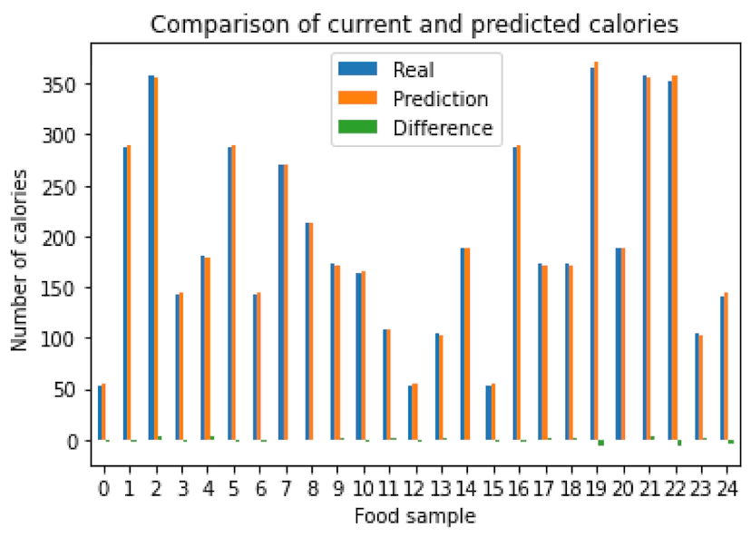

# Modelado de dieta

## Descripción
Desarrollé esta modelo matemático usando regresión lineal para estimar la cantidad de calorías que cualquier alimento aporta basado en sus nutrientes.

## Características
- Limpieza de datos
- Visualización de los datos

## Tecnologías empleadas:
- Python
- Pandas
- Sklearn
- Matplotlib

    
    

        Figura 1. Visualización del modelo predictivo en contraste con los datos de prueba
    

